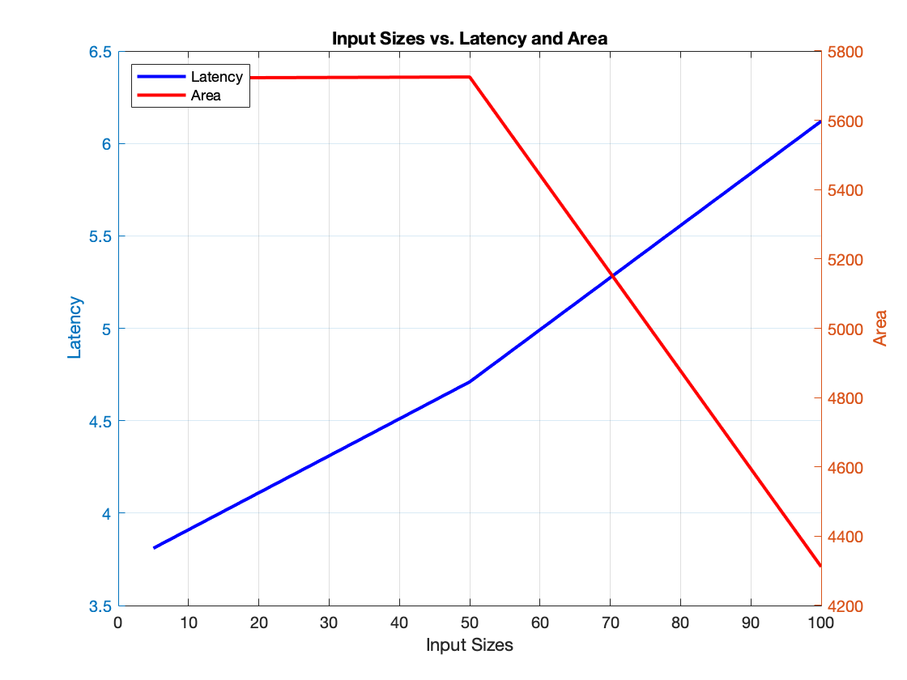
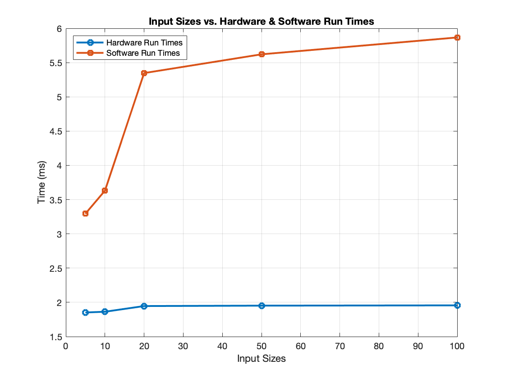

# SHA-1 Hardware-Software Codesign Exploration

## Introduction
This study presents the exploration of SHA-1 utilizing both hardware and software to speedup the generation of hashes. SHA-1 is designed to execute on the programmable logic of the TUL PYNQ Z2 board leveraging Xilinx HLS tools. The hardware implementation is compared to a software implementation done in Python. The effect of increasing input sizes is studied for both implementations and different hardware optimizations are compared based on resource utilization and latency. 

## SHA-1
The Secure Hash Algorithm 1 (SHA-1) is a cryptographic hashing function developed by the National Security Agency (NSA) and released by the National Institute of Standards and Technology (NIST) in 1995. It is a part of the SHA family of hash functions which includes SHA-0, SHA-2, and SHA-3.

SHA-1 generates a 160-bit hash value from input data of any size. For the same input, SHA-1 will produce the same output. The idea is that even if there is a small change in the input data, it should result in a significantly different hash output. This results in the algorithm generating a unique representation of the input data which makes SHA-1 useful for various cryptographic applications such as digital signatures and file verification. SHA-1 was designed so that reverse-engineering the original input data from its hash value would be nearly impossible. But over time weaknesses in SHA-1’s design have emerged making it no longer recommended for cryptographic applications. Collision attacks, where different input data produces the same hash value, have been discovered. Instead, the adoption of more secure alternatives like SHA-256 have been promoted. However SHA-1 still remains in some older systems that have yet to update to more secure options. 

## Software Implementation
SHA-1 was implemented in Python as a function for software performance reference to later compare with the hardware implementation. The function first starts off by initializing five 32-bit variables with hexadecimal values which represent the initial hash values. Then a helper function is defined that performs a left rotation operation on a 32-bit number. Then it encodes the input message into bytes utilizing UTF-8 encoding. The bit ‘1’ is appended to the message, and next ‘0’ bits are appended until the message length in bits modulo 512 is equal to 448 bits. Next, the padded message is broken up into 512 bit chunks. For each chunk, the chunk is broken up into 16 32-bit words, those 16 bit words are extended into 80 words, five variables are initialized with the current hash values, and a loop is entered for 80 iterations. In the 80 iteration loop, also referenced as the main SHA-1 loop in this study, based on the iteration number bitwise operations are performed and the hashes are updated. Finally, the hash values are concatenated into a single string and that string is returned. To verify the correctness of the algorithm, the generated hash was compared to the hash generated using the SHA-1 implementation found in the hashlib library in Python. 

## HLS Implementation
For the HLS implementation, the Python function created was converted into C++ code. A couple things needed to be corrected from the Python code in order for the HLS code to synthesize. One such correction was that the HLS implementation needed a fixed input size since array sizes were determined based on the input size. In hardware, an array size cannot be determined based on an input variable. Thus, the HLS code uses a preprocessor directive to define the input size of the message: `#define INPUT SIZE 5`.

Another issue that needed to be fixed, was that the SHA-1 C++ function could not take a string as an input. Instead it took the ASCII values of each character in the string as integers. To fix an II violation that occurred after synthesis, array partitioning was applied to the array that stores the broken down chunks. Then using an AXI streaming interface the input string is streamed in and the output hash is streamed out. A C++ testbench was written to verify the correctness of the algorithm. The output hash was compared to the hash produced by an online SHA-1 hash generator. 

## Hardware Design
Using the RTL generated from synthesizing the HLS code, a component was created. This component was used in the overlay designed in Vivado with the name sha1_0. The sha1_0 block was connected to the AXI direct memory access (DMA) block which allowed for the data transfer within the design. This block design is shown in Figure 4. After generating a HDL wrapper for the block design, the bitstream was generated. Using the .bit and .hwh files, this overlay was instantiated in a Jupyter Notebook. Using an input and output buffer, the input ASCII values are fed into the input AXI stream. The five output hash values are extracted from the output AXI stream and are concatenated together. The output hash was then compared to the hash produced by an online SHA-1 hash generator to validate the design. 

## Comparing Input Sizes 
By changing the preprocessor directive that defines the input size of the message in the HLS code, different input sizes performance metrics were recorded after synthesizing the design in Vitis. The area was calculated using the following equation: Area = Max(FF,LUT) + 100 * BRAM.

| Input Size | Latency (μs) | FF | LUT | BRAM | Area |
| :---: | :---: | :---: | :---: | :---: | :---: |
| 5 | 3.81 | 5719 | 3780 | 0 | 5719 |
| 10 | 3.91 | 5721 | 3783 | 0 | 5721 |
| 20 | 4.11 | 5723 | 3783 | 0 | 5723 |
| 50 | 4.71 | 5725 | 3785 | 0 | 5725 |
| 100 | 6.12 | 3317 | 4012 | 3 | 4312 |

*Table 1: Varying Input Size Performance Metrics*

*Figure 1: Input Sizes vs. Latency and Area*

It was seen that increasing the input size, increased the latency and also slightly increased the area for the most part. The increased latency followed the expected behavior as a larger input size would result in more iterations in the algorithm. The area for the largest input size tested, 100, was the smallest area of all the designs. The reason behind this could be that Vitis automatically applied a pipeline optimization when synthesizing the HLS code.

The five designs with varying input sizes were imported into Vivado and bitstreams were generated for each design. Next, a Jupyter notebook was created that compared the performance of the different hardware designs versus the software implementation.

*Figure 2: Input Sizes vs. Hardware and Software Run Times*

As seen from the results, the hardware executing time followed a similar trend to the latency values from Figure 1 as expected. From Figure 2, it can be seen that the input sizes had a smaller effect on the hardware run times when compared to the software hardware times. This could be due to the software having a large variability of performance when running on the Jupyter notebook. The software run times were almost twice as longer than the hardware run times for input sizes of 5 and 10 and almost three times as longer than the hardware run times for input sizes of 20, 50, and 100. 

## Design Optimization
The area and latency were compared in 6 designs with different HLS optimizations and a pareto graph was made using the area and latency values as seen in Figure 3.

| Design Number | Description | Latency (μs) | Area |
| :---: | :---: | :---: | :---: |
| 1 | Base Design | 3.81 | 5719 |
| 2 | Loop Unrolling | 2.17 | 83770 |
| 3 | Loop Pipelining | 2.66 | 3995 |
| 4 | Loop Fission | 1.39 | 37183 |
| 5 | Design 4 with Loop Unrolling | 2.17 | 83770 |
| 6 | Design 4 with Loop Pipelining | 2.82 | 5152 |

*Table 3: HLS Optimizations*

